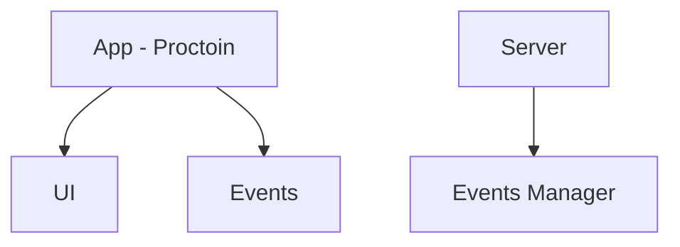
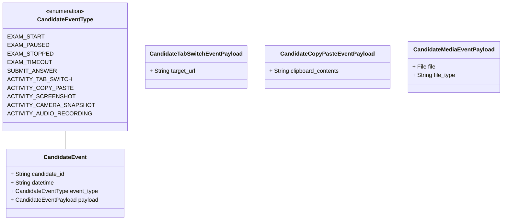
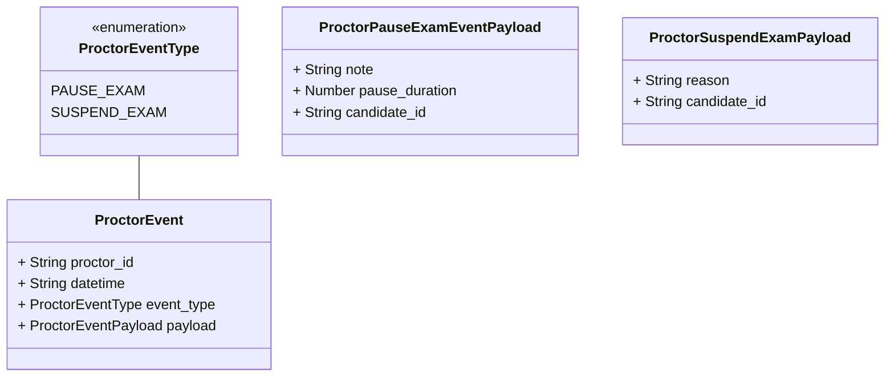
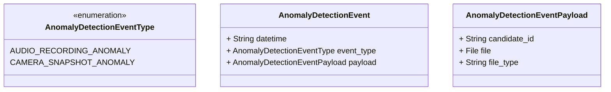
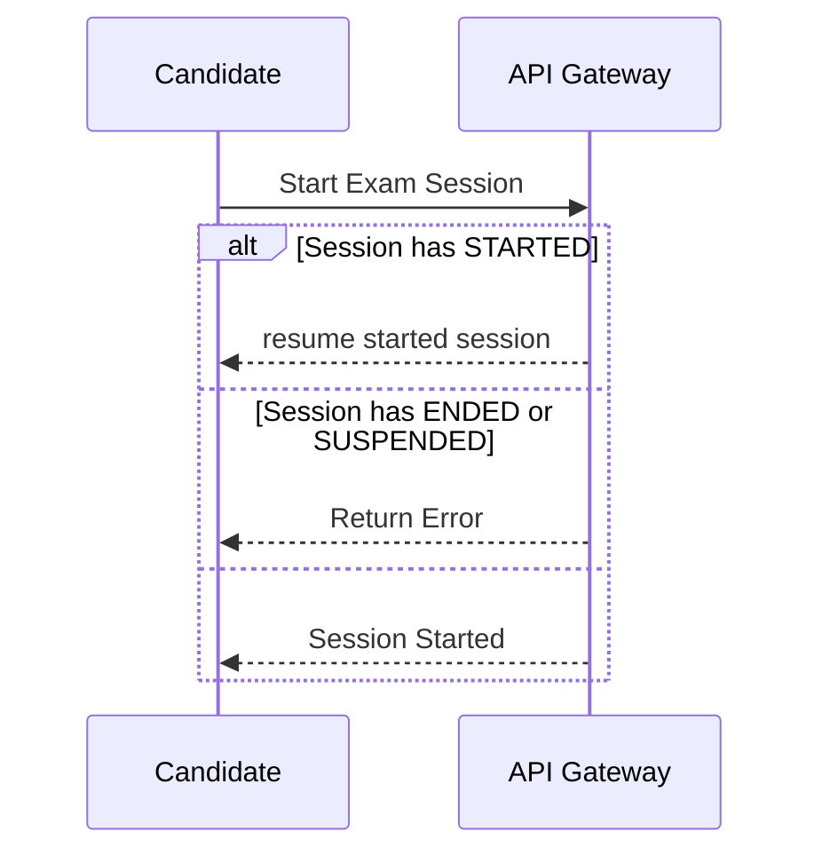
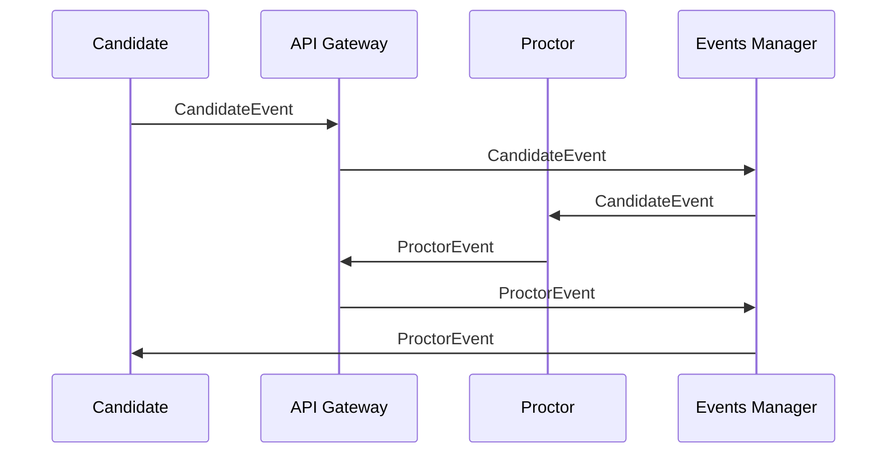

## Getting Started  

Open a terminal and run the following commands
```sh
npm install
nx run-many -t dev
```

### High Level Overview


###  Actors / User Stories
Candidate:  
- As a Candidate I want to start an exam session
- As a Candidate I want to answer a started exam question
- As a Candidate I want to end an exam session

Proctor: 
- As a Proctor I want to list suspicious sessions real-time
- As a Proctor I want to inspect a suspicious session events real-time
- As a Proctor I want to pause an exam session that require intervention
- As a Proctor I want to suspend an exam session 

### CandidateEvent



### ProctorEvent


### AnomalyDetectionEvent









### Areas of Improvement
1. Client Side
		1. Adding unit tests to core functionality
		2. Adding user friendly error messages
		3. Errors recovery and re-connects
		4. Adding missing critical UX interactions e.g. highlight selected candidate
		5. Replace global context with zustand
		6. Implement missing features
			1. Custom View Modes
			2. Candidates List Filtering and Fuzzy Search
			3. Graphs and Visualization
			4. Candidate Details Page
			5. Automation tab
			6. Logs Inspection tab
			7. Custom Proctor Event Messages
			8. Handle transient states properly

2. Server Side
	1. Adding unit tests
	2. Relay received events for events manager to process
	3. Integrate with anomaly detection service
	4. Emulate candidates interaction
	5. Use in memory DB for aggregated statistics fast access
	6. Use DBMS for persisting received events
	7. Offload more heavy lifting tasks to backend

3. General
	1. Better  Git commits
	2. Complete diagrams
  3. Clean unnecessary files
  4. Setup linting and formatting
  5. Better deployment


## AI Usage
- No code generation was used in developing this application. I have used AI for reasoning and validation.
